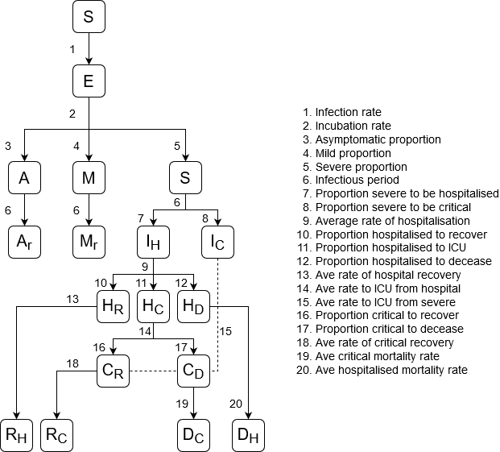

# Assa Covid Model
  
The Actuarial Society of South Africa's (ASSA) Covid model provides a framework for projecting the health care impact on South Africa due to Covid-19. The codebase for this model has been built and is maintained by [Percept](https://percept.co.za/).


## Model Structure
The model is an extended version of a common epidemiological compartmental SEIR model, which defines a non-linear set of coupled ordinary differential equations (ODEs). The model structure is represented by the diagram below.



The transition rates between the model states are labelled numerically. The infectious states `A`, `M`, and `S` represent asymptomatic, mild, and severe cases. Hospitalised states are represented by `H`, while critical care states are represented by `C`. Hospital and critical care discharges are given by `R` states, while deceased cases are given by `D` states.


## Installation

Run
```buildoutcfg
git pull https://github.com/Percept-Health-Solve/seir-model.git
```
to download the repository. The framework for the model is found in the `seir/` folder. You will largely be interacting with the `main_fitting.py` script, which will setup and run the model while fitting to data.

### Requirements
The model requires Python version >= 3.7. To install the required packages, run
```buildoutcfg
pip install -r requirements.txt
```

## Quick Start
Ensure that you are in the root directory of the model. To run the model, fitting to national death data, run
```buildoutcfg
python main_fitting.py --fit_deaths --fit_daily --fit_interval 3 --output_dir ./results/national
```
To fit to provincial deaths, for example the western cape, run
```buildoutcfg
python main_fitting.py --fit_deaths --fit_daily --fit_interval --province WC --output_dir ./results/WC
```

The parameters for these runs are explained below.

## Usage
### Fitting
The model is currently set up to fit to a set of data. By default, this will fit to the [data](https://github.com/dsfsi/covid19za) provided by the [Data Science for Social Impact research group](https://dsfsi.github.io). Fitting is done using a sampling-importance-resampling (S-I-R) algorithm, which makes use of model parameters with a number of samples `M` and take a smaller number of resamples `m`, where the weight of the resample is weighted according to the importance of the output of the initial `M` samples. The importance of the model output against the provided data is modelled by a log-normal distribution. Normally `m/M` is around 1/20.

#### Sample and Age Parameters
These parameters define the number of samples the model will take when solving the SEIR ODEs. The model also allows multiple population groups to be considered, though at the moment the only population group considered are those defined by ten year age bands (from 0-9, 10-19, ..., 80+).
- `--nb_samples`: Defines the number of samples in the S-I-R algorithm. Will solve the set of SEIR ODEs X times for each of the sampled parameters.
- `--no_age_heterogeneity`: Will remove the age heterogeneous population groups from the model's behaviour, and instead fit using age-average statistics for parameters.

#### Data Parameters
- `--data_source`: Source of data on which to fit. Defauls to the total population data from the DSFSI. Can be constructed to filter for a province, by parsing as `dsfsi/<province>`, where `<province>` is the 2-3 letter code for a South African province. Can also point to a csv file, where it will attempt to find the columns `deaths`, `hospitalised`, `critical`, `infected`, and `recovered` at least one of these should be present) and construct a data object for fitting from that. **The csv feature has yet to be implemented, but is currently being developed.**
- `--min_date`: Filters out data points before this date. Must be in `%Y/%m/%d` format.
- `--max_date`: Filters out data points after this date. Must be in `%Y/%m/%d` format.

#### Fitting Parameters
The following parameters are available to change the behaviour of the fitting algorithm:
- `--fit_infected`: Fit to cumulative detected infected cases. **Note:** this is not advised, as the model produces asymptomatic and mild cases, whose real world detection rate may be slim to none.
- `--fit_hospitalised`: Fit to hospitalised cases, if available. Not available for DSFSI data.
- `--fit_critical`: Fit to critical care cases, if available. Not available for DSFSI data.
- `--fit_deaths`: Fit to cumulative deaths, if available.
- `--fit_recovered`: Fit to cumulative recovered cases, if available. Note that the ASSA model currently does not support this feature outside of cases that have been discharged from hospital.
- `--fit_daily`: Will fit to daily infected/recovered/death cases instead of cumulative cases. Used to remove the serial independance of the data.
- `--fit_interval`: Only fit to data every X intervals, in days. If fit_daily is set, it will add the data in within this interval in order to help mitigate noise due to daily reporting inaccuracies.
- `--nb_runs`: The number of runs the model takes (defaults to 1). Used to increase the number of random samples within the model while avoiding memory issues.
- `--ratio_resample`: The ratio of resamples to take in the S-I-R algorithm. Defaults to `1/20=0.5`.

#### Lockdown Parameters
You can define a lockdown (a decrease in its transmissibility, or in its Rt value) of the disease and its length using these parameters.

- `--rel_beta_lockdown`: Defines either a single value, or bounds of a uniform distribution, that scale the strength of the infectious beta parameter (where beta is the number of people an infectious person is expected to infect on average, related to Rt) during a lockdown. The lower bound of a uniform distribution can be set to a negative value, implying that the lower bound will be determined by the previous lockdown's strength (to within the negative value given). The upper bound can also be a negative value, implying the upper bound of the uniform distribution will be informed by the strength of the previous lockdown (added by the value set).
- `--rel_beta_period`: Defines the length of time (in days) for which the lockdown period defined above will be applied. 

 These parameters can be called multiple times in order to define successive lockdown periods of varying effectiveness (such as introducing multiple staged lockdowns, as many countries have done). This would be done as follows:
 ```buildoutcfg
--rel_beta_lockdown 0.5 0.9 --rel_beta_period 30 --rel_beta_lockdown 0.6 0.7 --rel_beta_period 20
```
This would define an initial lockdown of 30 days, with a uniform prior U(0.5, 0.9) (acting on the infectivity strength of a no lockdown scenario); followed by a second lockdown period of 20 days with a uniform prior U(0.6, 0.7).

#### ODE Parameters
These parameters define the inner workings of the set of ordinary differential equations underlying the ASSA model. Defaults of these parameters can be found in the `seir/defaults.py` file. All parameters can be set with a single value (defining a float), or two values (defining a uniform prior that is fit to data). Caution should be taken when changing these values, as defaults of many of these parameters have been informed by literature studies and analysis on sensitive data.

- `--r0`: The number of secondary infections expected to occur due to a single infected individual.
- `--rel_beta_asymptomatic`: The relative infectiousness strength of asymptomatic individuals.
- `--prop_a`: Proportion of cases that remain asymptomatic. Does not include presymptomatic cases.
- `--prop_s`: Proportion of symptomatic cases that are expected to become severe. Mild symptomatic cases are calculated as (1 - `prop_a`) * (1 - `prop_s`). Can be called multiple times to define the proportion of severe cases expected in each population group.
- `--prop_s_to_h`: Proportion of severe cases that are expected to present to a general ward in hospital. The proportion of severe cases that are expected to present directly in critical care is calculated by `1 - prop_s_to_h`. Can be called multiple times to define the proportion of severe cases expected in each population group.
- `--prop_h_to_c`: Proportion of general ward cases that are expected to transition to critical care. Can be called multiple times to define the proportion of severe cases expected in each population group.
- `--prop_h_to_d`: Proportion of general ward hospital cases that are expected to die. Can be called multiple times to define the proportion of severe cases expected in each population group.
- `--prop_c_to_d`: Proportion of critical care cases that are expected to die. Can be called multiple times to define the proportion of severe cases expected in each population group.
- `--time_incubate`: Time of incubation of the disease, from contraction until infectiousness.
- `--time_infectious`: Time of infectiousness of the disease.
- `--time_s_to_h`: Days from onset of symptoms to presenting in general hospital ward, for those that will present to hospital.
- `--time_s_to_c`: Days from onset of symptoms to presenting in a critical care ward, for those that will present to critical care.
- `--time_h_to_c`: Time from general hospital admission to critical care admission, for those that will make such a transition.
- `--time_h_to_r`: Time from general hospital admission to recovery, for those that will recover.
- `--time_h_to_d`: Time from general hospital admission to death, for those that will die.
- `--time_c_to_r`: Time from critical care admission to recovery, for those that will recover.
- `--time_c_to_d`: Time from critical care admission to death, for those that will die.
- `--contact_k`: Contact heterogeneity factor as per Kong et. al. A value of 0 or lower removes contact heterogeneity from the system.
- `--mortality_loading`: Adjusts the mortality proportions of the model while keeping the overall mortality shape vy age the same. Used to inform the uncertainty in the mortality estimates while ensuring the mortality by age remains sensible. Should be close to 1.
- `--hospital_loading`: Adjusts the proportions of individuals going to hospital, while keeping the proportions by age constant within the hospital. Used to inform the uncertainty in inbound patients while ensuring the inbound patient distribution remains sensible. Should be close to 1.

#### Initial Parameters
These parameters define the initial value of the ODE.

- `--t0`: Initial time of the starting seed. Defaults to 50 days before the lockdown.
- `--prop_e0`: The proportion of the population that are exposed at time `t0`. Serves as the seed for the SEIR model. Defaults to a uniform prior U(0, 1e-5).

#### Output Parameters
- `--output_dir`: Directory at which to place the output projects and plots. Will create the directory if it doesn't exist. If the directory does exist, and contains any files, the script will raise an error requiring the `--overwrite` flag to be set, or for a new empty directory to be given.
- `--overwrite`: Will overwrite the output files in the output directory. 

#### Output Files
The output of the model is sent to the directory given by `--output_dir`. These files will include:
- `predictions_long_term.png`: Collection of plots of the projected number of infected, hospitalised, critical, recovered, and deaths over the long term.
- `predictions_short_term.png`: Collection of plots of the projected number of infected, hospitalised, critical, recovered, and deaths over the long term. Includes a visualisation of the fitting data.
- `prior_posterior.png`: Distribution of plots of the prior and posterior distributions of a number of selected parameters (defined above).
- `projections_by_age.csv`: Daily projections of the infected, deaths, hospitalised, and critical cases, from 2020-02-06 to 2021-01-20, for all age groups. Only available if the model has been run in an age heterogeneous mode (which occurs by default).
- `projections_total.csv`: Daily projections of the total infected, deaths, hospitalised, and critical cases, from 2020-02-06 to 2021-01-20. 
- `runs/` folder: Contains the results from each individual run.
- `*.pkl` files: Python pickle files that contain the raw numpy arrays of the prior and posterior sample distributions. Useful for meta analysis later.

